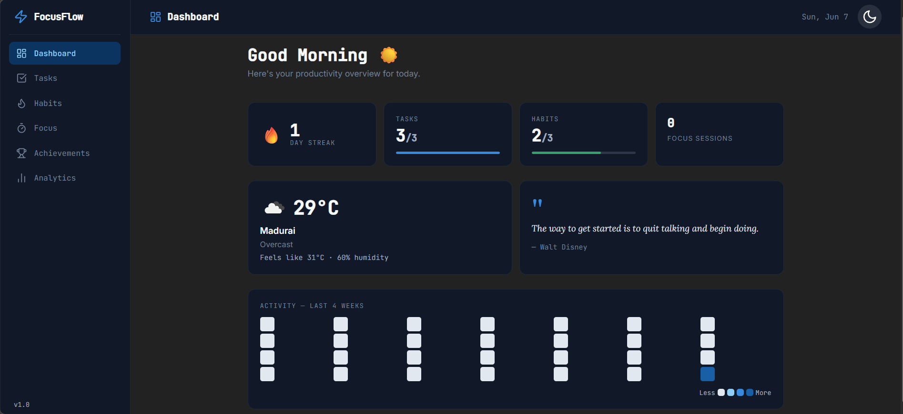
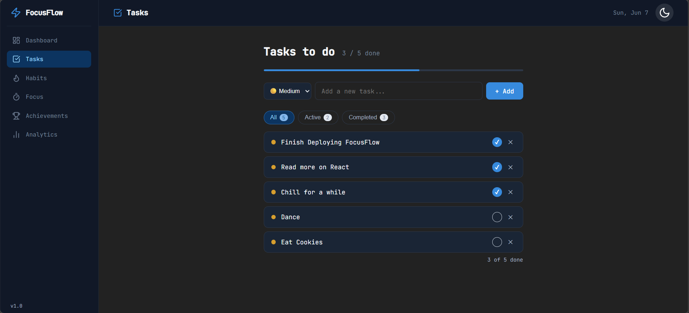
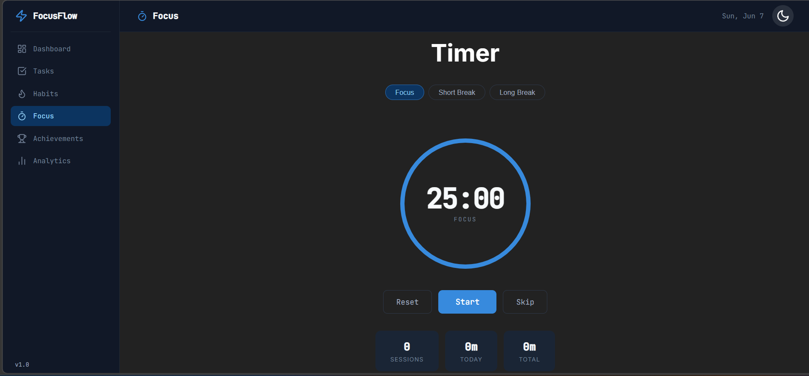
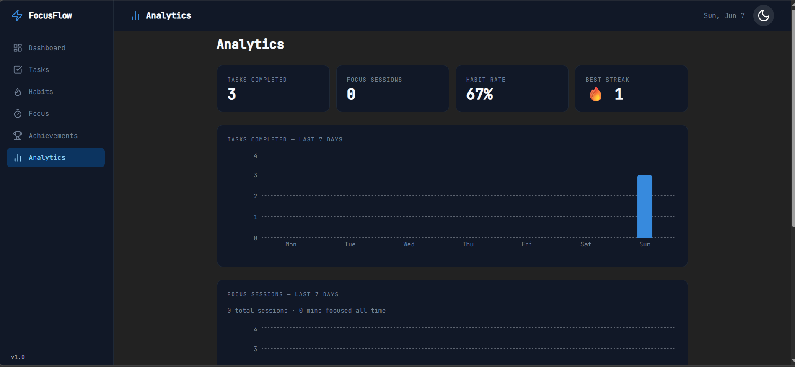

# ⚡ FocusFlow

A clean, professional personal productivity dashboard built with React + Vite.

Not just a todo app — everything you need in one place.


---

## 📸 Screenshots

### Dashboard



### Tasks



### Focus Timer



### Analytics



### Achievements


🔗 **[Live Demo → focusflow.vercel.app](https://focus-flow-navy-alpha.vercel.app)**

## ✨ Features

### 📋 Tasks

- Add, complete, and delete tasks
- Priority levels — High 🔴 / Medium 🟡 / Low 🟢
- Filter by All / Active / Completed
- Progress bar showing completion
- Persists across refresh via localStorage

### 🔥 Habits

- Track daily habits with streaks
- Automatic streak counter — miss a day and it resets
- Daily reset — habits refresh every new day
- Progress bar for today's completion rate

### ⏱ Focus Timer

- Pomodoro-style countdown timer
- Focus (25m) / Short Break (5m) / Long Break (15m)
- Animated ring progress
- Session counter — tracks completed focus sessions
- Daily session log for analytics

### 🌤 Weather

- Auto-detects your location via browser geolocation
- Falls back to Madurai if location denied
- Powered by Open-Meteo — no API key needed
- Shows temp, feels like, humidity, description

### 💬 Quote of the Day

- Fetches a fresh quote daily via ZenQuotes API
- Cached in localStorage — one fetch per day
- Fallback quotes if API is unavailable

### 📊 Analytics

- Tasks completed per day — bar chart
- Focus sessions per day — bar chart
- Habit completion rate — percentage
- Per-habit streak breakdown
- Powered by Recharts

### 🗓 Activity Heatmap

- GitHub-style 4-week activity heatmap
- Tracks tasks + habits combined
- 4 activity levels — light to dark blue

### 🏅 Achievements

- 9 unlockable badges
- Tracks tasks, habits, streaks, focus sessions
- Locked badges shown with 🔒

### 🌙 Dark / Light Mode

- Persistent theme via localStorage
- Smooth transition
- Every component themed

---

## 🗂 Project Structure

```
src/
│
├── components/
│   ├── layout/
│   │   ├── Navbar.jsx
│   │   ├── Sidebar.jsx
│   │   └── ThemeToggle.jsx
│   │
│   ├── dashboard/
│   │   ├── GreetingCard.jsx
│   │   ├── StreakCard.jsx
│   │   ├── ProgressCard.jsx
│   │   ├── WeatherWidget.jsx
│   │   ├── QuoteWidget.jsx
│   │   └── HeatmapWidget.jsx
│   │
│   ├── tasks/
│   │   ├── TaskForm.jsx
│   │   ├── TaskList.jsx
│   │   └── TaskItem.jsx
│   │
│   ├── habits/
│   │   ├── HabitForm.jsx
│   │   ├── HabitList.jsx
│   │   └── HabitItem.jsx
│   │
│   ├── focus/
│   │   ├── Timer.jsx
│   │   └── SessionStats.jsx
│   │
│   ├── achievements/
│   │   └── BadgeCard.jsx
│   │
│   └── analytics/
│       ├── TasksChart.jsx
│       ├── FocusChart.jsx
│       └── HabitChart.jsx
│
├── pages/
│   ├── Dashboard.jsx
│   ├── Tasks.jsx
│   ├── Habits.jsx
│   ├── Focus.jsx
│   ├── Achievements.jsx
│   └── Analytics.jsx
│
├── hooks/
│   ├── useLocalStorage.js
│   ├── useTimer.js
│   ├── useTheme.js
│   └── useWeather.js
    └── useUser.js
│
├── context/
│   └── UserContext.jsx
│
├── data/
│   ├── badges.js
│   └── quotes.js
│
├── constants/
│   └── index.js
│
├── utils/
│   ├── helpers.js
│   ├── dateUtils.js
│   └── achievementUtils.js
│
├── styles/
│   ├── index.css
│   ├── theme.css
│   └── components.css
│
├── App.jsx
└── main.jsx
```

---

## Getting Started

### Prerequisites

- Node.js 18+
- npm or yarn

### Installation

```bash
# clone the repo
git clone https://github.com/yourusername/focusflow.git
cd focusflow

# install dependencies
npm install

# start dev server
npm run dev
```

### Environment Variables

No API keys required for core features.

Create a `.env` file at the root if you want to use OpenWeatherMap instead of Open-Meteo:

```env
VITE_WEATHER_API_KEY=your_openweathermap_key_here
```

Open-Meteo is used by default — completely free, no key needed.

---

## 🛠 Tech Stack

| Tool            | Purpose                      |
| --------------- | ---------------------------- |
| React 18        | UI framework                 |
| Vite            | Build tool                   |
| React Router v6 | Client-side routing          |
| Recharts        | Analytics charts             |
| Lucide React    | Icons                        |
| Open-Meteo API  | Weather — no key needed      |
| ZenQuotes API   | Daily quotes — no key needed |
| localStorage    | Data persistence             |

---

## 📦 Dependencies

```bash
npm install react-router-dom recharts lucide-react
```

---

## 🗺 Roadmap

### v1.0 — Current

- [x] Tasks with priority
- [x] Habits with streaks
- [x] Pomodoro focus timer
- [x] Weather widget
- [x] Daily quote
- [x] Activity heatmap
- [x] Achievements/badges
- [x] Analytics with charts
- [x] Dark/light mode
- [x] localStorage persistence

### v2.0 — Planned

- [ ] User authentication
- [ ] Cloud sync via Supabase
- [ ] Mobile responsive layout
- [ ] Task due dates
- [ ] Habit categories
- [ ] Weekly/monthly analytics view

## Architecture

Context API setup ready for v2 cloud sync feature

---

## Pages

| Page         | Description                               |
| ------------ | ----------------------------------------- |
| Dashboard    | Overview — weather, quote, heatmap, stats |
| Tasks        | Add and manage tasks with priority        |
| Habits       | Daily habits with streak tracking         |
| Focus        | Pomodoro timer with session stats         |
| Achievements | Unlockable badges based on activity       |
| Analytics    | Charts and stats for tasks, focus, habits |

---

## 📄 License

MIT License

Copyright (c) 2026

---

## 🙏 Credits

- Weather — [Open-Meteo](https://open-meteo.com)
- Quotes — [ZenQuotes](https://zenquotes.io)
- Icons — [Lucide](https://lucide.dev)
- Charts — [Recharts](https://recharts.org)

---

Built by [Dharshini]
